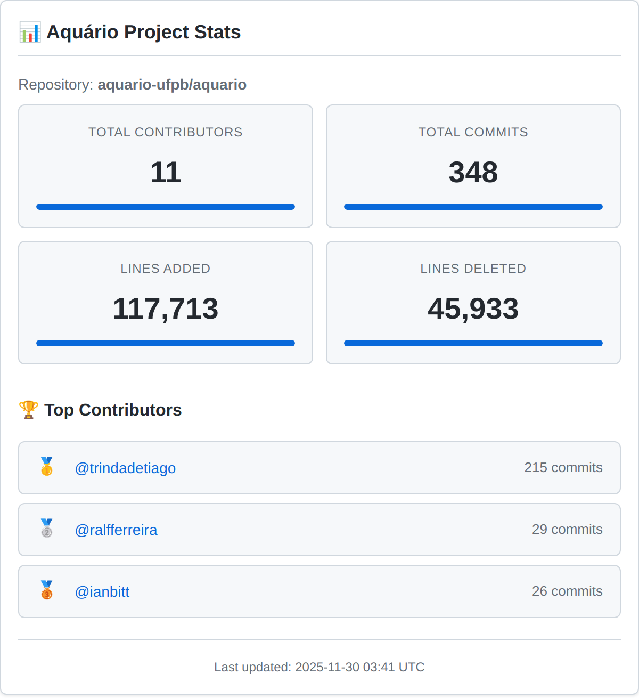
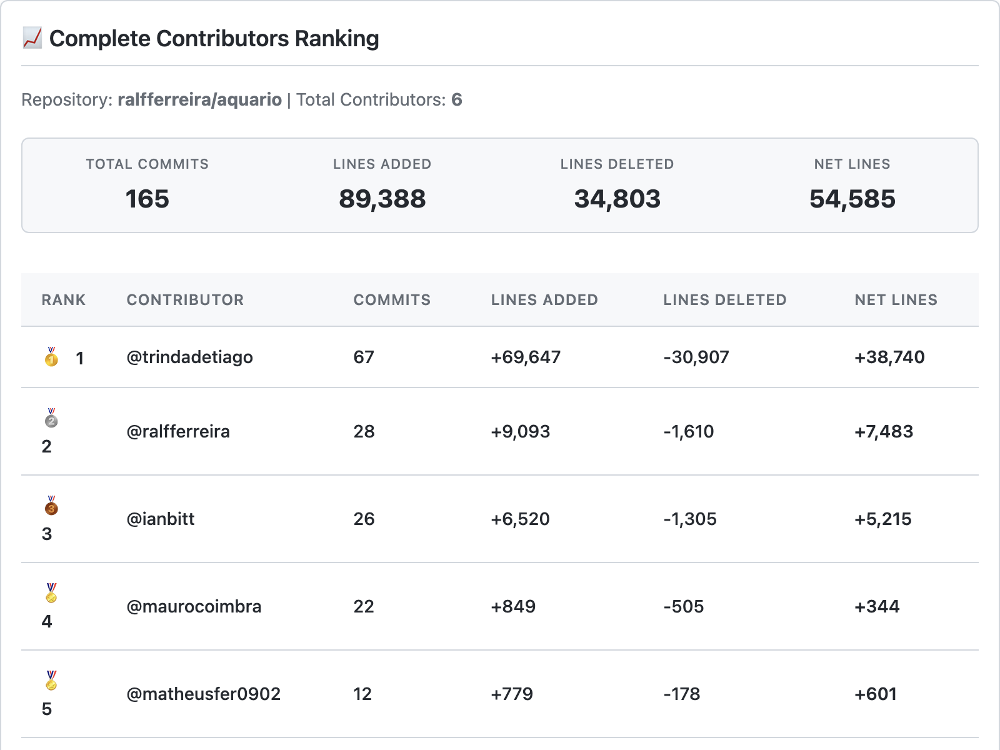

# 📊 Aquário Stats

> Gerador automático de estatísticas de contribuidores para o repositório [Aquário](https://github.com/ralfferreira/aquario)

## 🎯 Sobre

Este repositório contém scripts e workflows automatizados para gerar estatísticas detalhadas dos contribuidores do projeto **Aquário** - o núcleo de informações do Centro de Informática (CI) da UFPB. As estatísticas são geradas automaticamente e podem ser facilmente integradas ao repositório principal do Aquário.

## 🚀 Funcionalidades

### 📈 Estatísticas Geradas

- **Visão Geral**: Total de contribuidores, commits, linhas adicionadas/removidas
- **Top Contribuidores**: Ranking dos principais colaboradores
- **Análise de Atividade**: Atividade semanal, tendências e padrões
- **Contribuidores Recentes**: Novos colaboradores das últimas 4 semanas
- **Distribuição de Commits**: Como os commits estão distribuídos entre os contribuidores
- **Resumo de Atividade**: Comparação entre diferentes períodos (4, 8 semanas e histórico completo)

### 🎨 Visualizações Geradas

- **Top 3 Contribuidores**: Widget estilo GitHub com os principais colaboradores
- **Ranking Completo**: Tabela detalhada com todos os contribuidores e métricas
- **Design GitHub-Native**: Estilo idêntico aos widgets do GitHub
- **Alta Qualidade**: Imagens renderizadas em alta resolução (2x DPI)

### 🔄 Automação

- **Execução Automática**: Roda todo domingo às 2h UTC
- **Trigger Manual**: Pode ser executado manualmente via GitHub Actions
- **Atualização Automática**: Commits automaticamente as estatísticas geradas
- **Integração Fácil**: Arquivo markdown pronto para uso no repositório principal

## 📁 Estrutura do Projeto

```
aquario-stats/
├── .github/
│   └── workflows/
│       └── contributor-stats.yml    # Workflow principal
├── scripts/
│   ├── fetch-contributors.js        # Busca dados dos contribuidores
│   ├── generate-insights.js         # Gera insights e markdown
│   └── generate-html-images.py     # Gera imagens HTML-to-PNG
├── templates/                        # Templates HTML estilo GitHub
│   ├── overview-stats.html          # Template widget visão geral
│   └── detailed-ranking.html        # Template ranking detalhado
├── images/                          # Imagens geradas automaticamente
│   ├── top3-contributors.png        # Gráfico top 3 contribuidores
│   └── complete-ranking.png         # Ranking completo
├── requirements.txt                 # Dependências Python
└── README.md                        # Este arquivo
```

## 🛠️ Como Funciona

### 1. **Coleta de Dados** (`fetch-contributors.js`)
- Conecta à API do GitHub
- Busca dados completos dos contribuidores do repositório `ralfferreira/aquario`
- Salva os dados em arquivos JSON para processamento

### 2. **Geração de Insights** (`generate-insights.js`)
- Processa os dados coletados
- Calcula métricas e estatísticas
- Gera análise de tendências
- Cria relatório em markdown formatado

### 3. **Geração de Imagens HTML** (`generate-html-images.py`)
- Cria templates HTML com design estilo GitHub
- Renderiza HTML para PNG usando Puppeteer
- Gera imagem do top 3 contribuidores
- Gera ranking completo com todos os dados
- Salva imagens em alta resolução (2x DPI)

### 4. **Automação** (GitHub Actions)
- Executa os scripts automaticamente
- Commita o arquivo `CONTRIBUTOR_INSIGHTS.md` e imagens geradas
- Pode ser executado manualmente quando necessário

## 📊 Exemplo de Saída

O script gera um arquivo `CONTRIBUTOR_INSIGHTS.md` com:

```markdown
# 📊 Contributor Insights

> **Repository:** ralfferreira/aquario  
> **Last Updated:** Sunday, January 12, 2025 at 02:00 AM  

## 🎯 Overview

| Metric | Value |
|--------|-------|
| **Total Contributors** | 6 |
| **Total Commits** | 211 |
| **Total Lines Added** | +15,420 |
| **Total Lines Deleted** | -2,340 |
| **Net Lines Changed** | +13,080 |

## 🏆 Top Contributors

🥇 **1.** [@ralfferreira](https://github.com/ralfferreira) - 89 commits
🥈 **2.** [@trindadetiago](https://github.com/trindadetiago) - 45 commits
🥉 **3.** [@ianbitt](https://github.com/ianbitt) - 32 commits
```

## 📋 Pré-requisitos

- Node.js 18+
- Python 3.9+
- Acesso à API do GitHub (para repositórios públicos, não é necessário token)
- Permissões de escrita no repositório (para commits automáticos)
- Dependências Python: `matplotlib`, `seaborn`, `numpy` (para widgets HTML)

## 🔧 Como Usar

### Execução Manual

1. Clone este repositório
2. Instale as dependências:
   ```bash
   # Instalar dependências Python
   pip install -r requirements.txt
   ```
3. Execute os scripts:

```bash
# Buscar dados dos contribuidores
node scripts/fetch-contributors.js ralfferreira aquario

# Gerar insights
node scripts/generate-insights.js

# Gerar widgets HTML
python scripts/generate-widgets.py
```

### Execução Automática

O workflow é executado automaticamente:
- **Todo domingo às 2h UTC**
- **Quando há push na branch main** (apenas se os scripts ou workflow mudaram)
- **Manualmente** via GitHub Actions

## 🔗 Integração com o Aquário

Para integrar as estatísticas ao repositório principal do Aquário:

1. **Copie o conteúdo** do arquivo `CONTRIBUTOR_INSIGHTS.md` gerado
2. **Cole no README** ou crie uma seção dedicada no repositório `ralfferreira/aquario`
3. **Inclua as imagens** da pasta `images/` para visualizações
4. **Atualize periodicamente** ou configure webhook para atualização automática

### Exemplo de Integração

```markdown
<!-- No README.md do Aquário -->
## 📊 Estatísticas do Projeto

<details>
<summary>Ver estatísticas detalhadas dos contribuidores</summary>

<!-- Cole aqui o conteúdo do CONTRIBUTOR_INSIGHTS.md -->




</details>
```